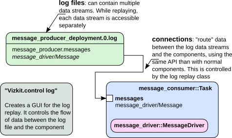

_Data replay_ is the ability to take data from log files and write it back into
live components. This is a very convenient ability if you want to test your
algorithm with a specific data set, to test on synthetic data sets, or if the
message producer is not available all the time. 

In this tutorial, we subsistute the message producer of the basics tutorial by a
log file which was previously on the "live" system.

The basic workflow is to get a logfile context using Orocos::Log::Replay and
then access the log streams as if they were tasks and ports:

~~~ ruby
#library for displaying data
require 'vizkit'

#load log file 
log = Orocos::Log::Replay.open("message_producer_deployment.0.log")

#now you can access all logged data by 
#addressing them by their task and port name
#log.task_name.port_name

#start deployment
Orocos.run "message_consumer_deployment" do 
    consumer = Orocos.name_service.get "message_consumer"
    log.message_producer.messages.connect_to consumer.messages
    consumer.start

    #open control widget and start replay
    Vizkit.control log
    Vizkit.exec
end
~~~

If, instead of pushing the data to a component, you want to process it in Ruby,
you can redirect it to code blocks:

~~~ ruby
require 'vizkit'

log = Orocos::Log::Replay.open("message_producer_deployment.0.log")
Orocos.run "message_consumer_deployment" do 
    consumer = Orocos.name_service.get "message_consumer"
    log.message_producer.messages.connect_to consumer.messages
    consumer.start

    # Redirect data to a code block
    log.message_producer.messages.connect_to |sample,_| do 
        puts sample.time
    end

    Vizkit.control log
    Vizkit.exec
end
~~~

The dataflow of the replay mechanism looks like:

{: .align-center}
