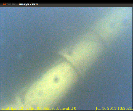
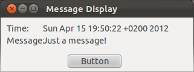

Abstract
-----------
In this tutorial you will learn how to display live and logged data with the help of Vizkit and how to 
write a custom GUI to display the data of your orocos task.

To understand this tutorial you must have competed the basic tutorials and the data
logging tutorial. Basic knowledge about Qt, Qt Designer and qtruby is also
necessary.

This tutorial directly continues from the last tutorials, additionally, you have
to have the rock packages gui/vizkit and gui/rock_widget_collection installed.

Displaying Data with Vizkit
-----------
Vizkit is a ruby framework build around qtruby to support the developer with functionality to display his
custom data in a convenient way. It is shipped with some Qt Widgets to display some basic types. 
But its real strength lies in the ability to be customized.

**Displaying Camera Samples** For some base types like the camera frame Vizkit has a special display widget.
To create an instance of a widget specialised to display camera frames you can use the Vizkit ruby 
method *display* and an Orocos port which is producing camera frames as argument. In the case below the camera is 
substituted by a log file called "bottom_camera.0.log" but you can use the same syntax for Orocos tasks as well.

~~~ ruby
require 'orocos'
require 'vizkit'

include Orocos
Orocos.initialize

log = Orocos::Log::Replay.open("bottom_camera.0.log")

Vizkit.display log.bottom_camera.frame
Vizkit.control log
Vizkit.exec
~~~

For testing purposes a small camera log file can be found [here](https://gitorious.org/rock-tutorials/advanced_data_visualization/blobs/raw/5ab9c7688e4b16980c05e5a3c1f0c7a24f3b21df/logfiles/bottom_camera.0.log). It shows an underwater test pipeline used during a student competition in Italy [Sauc-E](http://www.sauc-europe.org/).

{: .align-center}

Designing a custom GUI 
-----------
Vizkit is able to load ui files created with the Qt Designer. In this case a small GUI is loaded whose ui file
can be found [here](https://gitorious.org/rock-tutorials/advanced_data_visualization/blobs/master/resources/test_gui.ui). If you want to create your own ui file, use the *Qt
Designer*, e.g. by calling *designer* on the command line.

This ui basically creates a window with two dedicated labels for writing strings 
(named *Time* and *Message*) and a push button (named *Button*) to trigger
actions. Further on this file is referred to as *test_gui.ui*.

To load the ui file with Vizkit use the Vizkit ruby method *load*. After the ui file is loaded
you can access all embedded objects by their object name and their qt signal/slots. 

~~~ ruby
require 'vizkit'
#load ui file
gui = Vizkit.load '210_test_gui.ui'

#do something if someone is clicking on the 
#button named Button
gui.Button.connect(SIGNAL('clicked()')) do
    puts 'someone presses the button'
    gui.Time.setText(Time::now.to_s)
end

#display something in the label named Time
gui.Time.setText(Time::now.to_s)
gui.Message.setText("Just a message!")

gui.show
Vizkit.exec
~~~

{: .align-center}

As you can see, this small script displays the current time and a
message. Each time the button is pressed, the message is displayed on the command
line and the time label is updated.

Connecting a custom GUI with an orocos task
-----------

Just running the ui is nice for testing purposes, but the more interesting part
is connecting it to a real orocos task.

Use the following script as a basic example for the interaction between a
vizkit-ui and an orocos task.

~~~ ruby
require 'vizkit'

include Orocos
Orocos.initialize

gui = Vizkit.load 'test_gui.ui'

Orocos.run 'message_producer_deployment' do 
    producer = Orocos.name_service.get 'message_producer'
    producer.configure

    #change a property when the button is pressed
    gui.Button.connect(SIGNAL('clicked()')) do
        # First: stop and cleanup the producer task
        producer.stop
        producer.cleanup

        # change the configuration
        producer.config do |p|
            p.uppercase = !p.uppercase
        end

        # start the task again
        producer.configure
        producer.start
    end

    # start the task
    producer.start

    # connect the port of message producer to our ui
    producer.messages.connect_to do |data,_|
        gui.Time.setText data.time.to_s
        gui.Message.setText data.content
    end

    # start vizkit
    gui.show
    Vizkit.exec
end
~~~

We do several things here which require some explanation:

 * As the action of the button we want to switch the configuration of the
   message producer. To do this we have to stop our current task and clean up
   the configuration. Then we change the config, configure the task again and
   start it. This scheme is necessary since it is currently the only safe way
   to change the configuration of a task. You will notice a slight pause in the
   time display when pressing the button, which results from this sequence.
 
 * We connect our two labels with the output port of the message producer. 

Connecting a custom GUI with log files
-----------
If you want to connect your GUI with a log file you can use the same method
like for an orocos task. The following scripts connects test_gui.ui to a
component, which uses the log from the [previous
tutorial](200_replay_1.html). Since we only display data, the button is
not connected.

~~~ ruby
require 'vizkit'

log = Orocos::Log::Replay.open('message_producer_deployment.0.log')
gui = Vizkit.load 'test_gui.ui'

# connect the port of message producer to our ui
log.message_producer.messages.connect_to do |data,_|
    gui.Time.setText data.time.to_s
    gui.Message.setText data.content
    data # never forget this!!!
end

gui.show
Vizkit.control log
Vizkit.exec
~~~

Summary
-----------
In this tutorial you learned how to write a simple GUI and how to
connect its object with log files and orocos tasks. 

Progress to the [next tutorial](220_3d_data_visualization.html).
