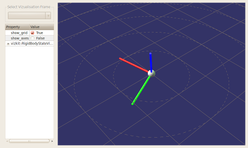

Abstract
-----------
In this tutorial you will learn how to display 3D data with the help of Vizkit.
For this tutorial you should already have read the [data visualization](210_data_visualization.html) tutorial.

Vizkit 3D
-----------
In Vizkit there is a dedicated subsystem for displaying 3D Data. It is called Vitkit3D. The 
basis for the 3D display is provided by a widget called 'Vizkit3dWidget', which is a vizkit widget.
On the Vitkit3dWidget one may register Vizkit3d-Plugins for displaying individual 3D data structures
inside the widget. 

As all of this is pretty confusing here the naming in short form :

  * VitzkitWidget : 2D Widget 
  * Vizkit3dWidget : The Vizkit-provided Vizkit that allows you to display 3D data
  * Vizkit3dPlugin : A plugin which is registered on the Vizkit3dWidget

How to use it
-----------
First we need to create the Vizkit3dWidget. We could do this in the same way as
we create any other VizkitWidget (i.e. by using default_loader.create_widget),
but Vizkit provides a shortcut:

~~~ ruby
require 'vizkit'
Orocos.initialize

## Create a widget for 3d display
view3d = Vizkit.vizkit3d_widget

# Show it
view3d.show
# And listen to GUI events
Vizkit.exec
~~~

The list of available Vizkit3DPlugins can be found TODO

For this tutorial, we pick a plugin, that will show an simple 3D representation of an Pose
in space. Note that you can add multiple Vizkit3DPlugins to the Vizkit3DWidget
to create complex 3D visualizations.

~~~ ruby
rbs_plugin = Vizkit.default_loader.RigidBodyStateVisualization
~~~

If you execute your script now, you should see a window with a sphere that is 'spiked' with three cylinders. 
By clicking inside the window and dragging you should be able to change the view.

Feeding data to your plugin
-----------
So, how do we pass new data to our visualizer. Quite simple, we just call
'updateRigidBodyState' on it, before you call Vizkit.exec

~~~ ruby
rbs = Types::Base::Samples::RigidBodyState.new

rbs.position = Eigen::Vector3.new(0, 5.0, 0)
rbs.orientation = Eigen::Quaternion.new(0, 0, 0, 1)

rbs_plugin.updateRigidBodyState(rbs)
~~~

