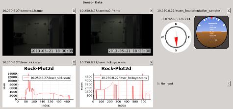

Abstract
-----------

In this tutorial you will learn how to display multiple widgets in a configurable grid using the CompoundDisplay widget. 

CompoundDisplay
-----------

The CompoundDisplay enables you to display multiple Rock widgets in one container. This container is designed as a two-dimensional grid. Each element of the grid holds one widget and is identified by its 'position'. This is a running index beginning at 0 going row-by-row from left to right. The grid dimensions (amount of rows and columns) are configurable from the script.

{: .align-center}
Example of the CompoundDisplay in action. You see five display widgets on positions 0-4 and an empty slot on position 5.
{: .caption}

One benefit of the CompoundDisplay is its ability to backup and restore your display widget configuration. That means you assign the widgets of your choice to specific grid coordinates and export this configuration to a YAML file. This feature is accessible through a slot or the optional toolbar (not shown in the picture). The configuration also includes information about the specific data sources, i.e. the task, port host of the data provider. Configurations can be either loaded upon startup (via script) or at runtime.

~~~ ruby
\---
0: !ruby/object:CompoundDisplayConfig
  task: 10.250.8.27/camera1
  port: frame
  widget: ImageView
  connection_policy: {}
1: !ruby/object:CompoundDisplayConfig
  task: 10.250.8.27/camera2
  port: frame
  widget: ImageView
  connection_policy: {}
2: !ruby/object:CompoundDisplayConfig
  task: 10.250.8.27/xsens_imu
  port: orientation_samples
  widget: OrientationView
  connection_policy: {}
3: !ruby/object:CompoundDisplayConfig
  task: 10.250.8.27/laser_sick
  port: scan
  widget: Plot2d
  connection_policy: {}
4: !ruby/object:CompoundDisplayConfig
  task: 10.250.8.27/laser_hokuyo
  port: scans
  widget: Plot2d
  connection_policy: {}
5: 
~~~

The corresponding YAML configuration file to the picture above.
{: .caption}

Besides configuring the grid in your script or YAML file, you can drag and drop output ports directly from the TaskInspector to the grid elements. A context menu lets you choose a suitable display widget. After you picked one, the widget will be displayed and automatically connected to the sender. This also works with rock-replay.

***IMPORTANT***:
To use the Drag&Drop feature, both the source and destination widget, i.e. TaskInspector and CompoundDisplay, have to be started in the same process. Simply start the TaskInspector in your script, as well, instead of using _rock-display_.
{: .warning}

The following script shows a basic example of how to use CompoundDisplay with multiple remote hosts.

~~~ ruby
require 'vizkit'

Orocos.initialize

# Add as many (remote) hosts as necessary.
hosts = []
hosts << "localhost"
# ...

# Add every host to the name service.
# We use an asynchronous connection for the GUI.
hosts.each do |host|    
    Orocos::Async.name_service << Orocos::Async::CORBA::NameService.new(host)
end

# Initialize and configure CompoundDisplay widget.
compound_display = Vizkit.default_loader.CompoundDisplay
compound_display.set_grid_dimensions(2,4) # 2 rows, 4 columns
#compound_display.show_menu(false)
compound_display.show

use_yaml = ARGV[0]

# Either configure CompoundDisplay by a predefined or previously exported
# YAML file or do it manually in the script. The connections are established
# automatically.
if use_yaml
    compound_display.configure_by_yaml("path_to_config.yml")
else
    # Manual configuration. 
    compound_display.configure(
            0, "front_camera", "frame", "ImageView")
    compound_display.configure(
            2, "message_producer", "messages", "OrientationView")
end    

# Initialize TaskInspector. You can drag output ports 
# from there to the CompoundDisplay.
inspector = Vizkit.default_loader.TaskInspector
inspector.show

# Add the previously defined name service. Do this only once, since we
# already appended all remote hosts to the name service before.
inspector.add_name_service(Orocos::Async.name_service)

Vizkit.exec
~~~
