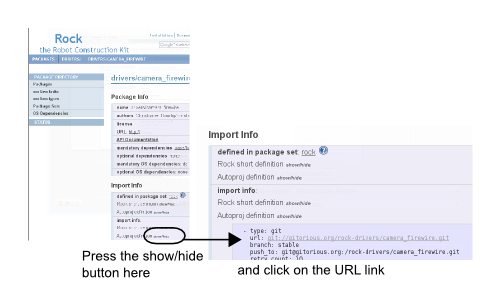

This page covers how to send modifications to code and documentation to the Rock
developers, assuming that you did not get a direct commit access to the
packages you modify. If you do feel that you contribute regularly enough to a
given package, drop a note to the package maintainer (whose email is stored in
the package's manifest.xml file) or to the [rock-dev mailing
list](http://www.dfki.de/mailman/cgi-bin/listinfo/rock-dev).

The other pages in this Contributing section cover the other aspects: how the
documentation is done, how to create new packages, ...

The main part of this page will deal with how to use gitorious to submit changes
to the Rock codebase and documentation. However, this workflow is only meant for
either big changes, or changes that will require a lot of discussion. For small
modifications such as typo fixes on the Rock documentation, one can use a
simpler workflow:

1. commit your changes to the relevant git repository
2. generate the necessary patches with
   ~~~
   git format-patch
   ~~~
   The list of files generated are displayed on the console by git.
3. [create a ticket](bugreports.html) describing your changes. Do not forget to
   tick the checkbox "I have files to attach to this ticket". Attach the
   patches.

When the changes are non-trivial, it prefer the gitorious method. It involves
creating yourself a __personal clone__, which will contain your changes, and
creating a __merge request__ to propose your changes to the Rock developers.

Personal Clones
---------------
Forks are used as private development repositories when you do not have commit
access to the main repository. To create one, go to the repository of the package you
modified. The package page on rock-robotics.org has a hyperlink to it:

Click the "Clone Repository" button

The new clone is named your_username-repositoryname.git, e.g.
rock-drivers/sylvain-camera_firewire.git for a rock-drivers/camera_firewire.git
repository and a username of "sylvain".

You can then push the (already committed) changes to the new clone:

~~~
cd drivers/camera_firewire
git push git@gitorious.org:rock-drivers/sylvain-camera_firewire.git HEAD:master
~~~

If you plan to do long-term development on your personal clone, you can select
it permanently in your autoproj installation by [adding an
override](../autoproj/customization.html). For instance, using the example above,
the overrides: section of autoproj/overrides.yml would look like:

~~~ yaml
overrides:
  - gitorious: rock-drivers/sylvain-camera_firewire
    branch: master
~~~

Creating a merge request in Gitorious
-------------------------------------
Once you've committed your work branch and pushed it back into your personal
clone in Gitorious, you can create a merge request which will alert the
Rock developers that your changes are ready, conveniently showing
what's changed and giving a place for comments and further revisions.

Login and go to the clone you created. Click the "Request merge" button on the sidebar
Fill out the fields:

* _Summary_ one-line description
* _Description_ more detailed description; references to related bug reports or
  documentation are always great here -- make sure reviewers know the purpose of
  your patch and what it's trying to resolve
* _Target repository_ in most cases this should be "mainline", unless you're
  coordinating with another developer's personal work clone
* _Target branch_ defaults to "master". If you are bugfixing from Rock's next or
  stable flavors, pick the corresponding branch.
* source branch select the work branch on your personal clone that you're
  merging.  Select commits generally you'll select all changes from the branch
  point to your last change.

When done, click "Create merge request".  A mail will be sent out to notify the
core developers. Any comments on the request will alert you back via e-mail as
well.

