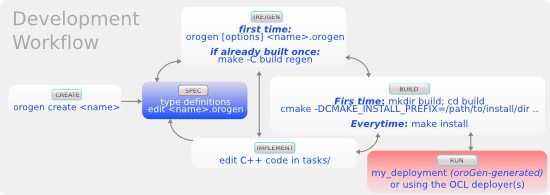
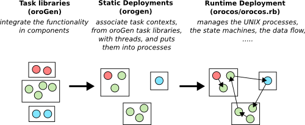

What are oroGen and typeGen
---------------------------

oroGen is a specification language and code generator for the [Orocos Realtime
Toolkit (RTT)](http://www.orocos.org/rtt). Orocos RTT is a C++ library allowing to build
component-based systems. The orogen tool allows to create new components easily.

In oroGen, one writes a specification that describes the component you want to
develop. Then, orogen generates the corresponding C++ code and CMake build
system so that you -- the component developer -- has only to care about
implementing the actual functionality.

oroGen has a smaller sibling, typeGen, that can be used to [generate standalone
typekits](type_definitions.html)

In any case, the following documentation is meant

Tutorials
---------

[The Rock tutorials](../tutorials/index.html) are a great introduction to oroGen
concepts and development workflow within Rock

The Development Workflow
------------------------

The most important point is that you ***cannot*** use your component/typekit
before you have installed it. So, don't forget to do 'make install'
{: .warning}

The Runtime Workflow
--------------------

One very important point when developing with Rock (actually, with Orocos/RTT
components), is that the _system deployment_ is separated from the _component
implementation_.

What it means in practice is that a task context (a.k.a. "RTT component") is a
standalone C++ class that can be integrated in different ways, instanciated
multiple times and so on.

oroGen keeps that separation. When you define components in oroGen, you create a
_task library_, which is a shared library in which the task context classes are
defined. Then, you need to put these libraries in _deployments_ (which is also
done by oroGen). Finally, you can start these deployments, connect the tasks
together, monitor them using either [the orocos.rb Ruby
bindings](../runtime/index.html) or the [advanced system
deployment](../system/index.html). They can also be used as [targets for log
replay](../data_analysis/index.html).

