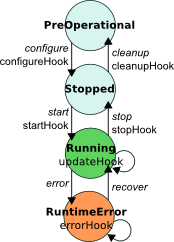
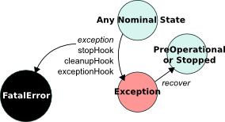

One important aspect of RTT task contexts is that they are not only an
interface. They also have a representation of a state machine.

The nominal RTT state machine
-----------------------------

 

On the left is depicted the **nominal** state machine. On each state transition,
the italic names are the names of the method that can make the transition
happen, and the non-italic name the name of the method that will be called on
the component so that it does something, i.e. the ones that you -- the component
developer -- must implement if something is needed for a particular transition.

The configureHook() and startHook() methods can return false, in which case the
transition is refused.

The RuntimeError state is a "degraded runtime" state. Use it when the component
can still perform its job partially. As an example, a motor driver hardware
could go into RuntimeError in cases where the hardware cannot control the motor
anymore -- for instance because of overheating protections in the hardware --
but can still read the motor parameters.

Error handling in the full RTT state machine
--------------------------------------------

 

Errors are represented in the way depicted on the left. The exception state is
used to represent errors that demand the component to stop, but can be recovered
from by restarting it. The fatal error state, however, is a terminal state:
there is no way to get out of it except restarting the component's process.

RTT will automatically transition from any state to Exception if a C++ exception
is "leaked" by one of the hooks (i.e. uncaught exception). Because of such a
transition, the stopHook and cleanupHook will be called before getting into
Exception.

If, while going into Exception, another C++ exception is caught, the component
will go into Fatal. In general, there should be no reason to transition to fatal manually.

Designing states in oroGen components
-------------------------------------
There are two points that need to be considered when writing an task context in
oroGen:

1. from which state should my component start ? It can start from either the
   Stopped or PreOperational state [more](#needs_configuration).
2. the ability to extend the default state machine by defining new sub-states.
   This is a great way to provide a fine-grained interface to monitor a task
   context's status [more](#extended_states)

Components that need configuration          {#needs_configuration}
----------------

Task contexts can either start from the Stopped state  or the PreOperational
state. In the first case, only the C++ method startHook() will be called to
start the component. In the second case, botht the configureHook() and
startHook() C++ methods will be called.

As its name implies, the transition between PreOperational and Stopped is meant
to encapsulate the need for complex and/or costly configuration. For instance,
trying to open and configure a device (which can take very long). To give you
another example, in hard realtime contexts, it is expected that startHook() is
hard realtime while configureHook() does not need to be.

If your component needs a configuration step, you will have to tell it to
oroGen. To do that, add the <tt>default_configuration</tt> statement in the task
context block:

~~~ ruby
task_context "Task" do
  needs_configuration

  # other definitions
end
~~~

Et voila !

**Removing or adding the <tt>needs_configuration</tt> flag after the first code
generation**

Adding and/or removing this flag actually requires to change the
signature of the constructor of the generated code.

So, when you change this flag, you need to:

1. open templates/task/TaskName.hpp and templates/tasks/TaskName.cpp
2. update the constructor declaration in task/TaskName.hpp and task/TaskName.cpp
   to match the declaration in the templates

Extending the state machine {#extended_states}
---------------------------

oroGen offers a way to have a more fine-grained reporting mechanism for
components to their coordination (or supervision) layer. This mechanism is based
on the definition of sub-states for each of the runtime and terminal states of
the task context state machine: Running, RunTimeError, Exception and Fatal.

These sub-states are declared in the <tt>task_context</tt> block of the oroGen
specification:

~~~ ruby
task_context "MotionTask" do
  # Sub-states of Running (nominal operations)
  runtime_states 'GOING_FORWARD', 'TURNING_LEFT'
  # Sub-states of RunTimeError (degraded functionality)
  error_states 'CANNOT_TURN'
  # Sub-states of Exception (non-nominal end)
  exception_states 'BLOCKED', 'SLIPPING'
  # Sub-states of Fatal (not recoverable error)
  fatal_states 'TOTALLY_BROKEN'
end
~~~

On the C++ side, this mechanism is available through two things:

* a States enumeration that defines all the states in a manner that is usable in
  the code
* the state(States), error(States), exception(States) and fatal(States) that
  allow to declare state changes in the C++ code.

For instance, if the updateHook() detects that the system is blocked, it would
do

~~~ cpp
void MotionTask::updateHook()
{
    // code
    if (blocked)
    {
        exception(BLOCKED);
        return;
    }
    // code
}
~~~

