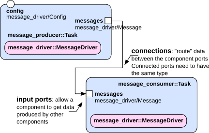

Abstract 
-----------------------
This tutorial will teach you:

* how to create a data driven component
* how to connect multiple components 

The data driven component that is designed in this tutorial waits for incoming messages and outputs their 
content once it receives a message. The incoming messages will be produced by the message_producer component
designed in the previous tutorials.

The final setup will look like:

{: .align-center}

Create a consumer component
-----------------------------

Your first task in this tutorial is to apply the acquired knowleged from the previous tutorials, and prepare a consumer component named 'message_consumer' and place in 'tutorials/orogen/'. Perform all step up to the point where you can edit the orogen specification, i.e.:

 * use [rock-create-orogen](110_basics_create_component.html) to create your component (note: you will need a
   dependency on both message\_driver and message\_producer)
 * check for any required dependencies and verify the manifest.xml
 * add your component to the build configuration, i.e. to autoproj/manifest

The next step will be to adapt the orogen specification. The component should allow to receive messages on an input port, and call the updateHook only when it receives a message. The specification should looks as follows: 

~~~ ruby
using_library "message_driver"
import_types_from "message_producer"

task_context "Task" do
   input_port "messages", "message_driver/Message"

   port_driven "messages"
end
~~~

The 'port_driven' statement allows you to specify ports, where incoming data triggers a call to the updateHook of the task (more details in the [documentation](../orogen/triggering/ports.html)).
Implement the updateHook, so that every incoming message is printed to stdout, using the existing printMessage function of your 'message_driver' library.

~~~ cpp
void Task::updateHook()
{
    TaskBase::updateHook();
    
    message_driver::Message message;
    _messages.read(message);

    mpMessageDriver->printMessage(message);
}
~~~

Build your component with 'amake'.

Connecting multiple components
------------------------------

You have designed a component that produces messages and a component that consumes messages. To connect them, you will use the Ruby scripting interface. Create a file start.rb in your consumer component's script folder (you will have to create the folder first) with the following content: 

~~~ ruby
require 'orocos'
require 'readline'

include Orocos
Orocos.initialize

Orocos.run 'message_producer::Task' => 'message_producer', 
    'message_consumer::Task' => 'message_consumer' do  
  
  message_producer = Orocos.name_service.get 'message_producer'
  message_consumer = Orocos.name_service.get 'message_consumer'
  
  # Never assume that a component supports being reconnected
  # at runtime, it might not be the case
  #
  # If you have the choice, connect before the component is
  # even configured
  message_producer.messages.connect_to message_consumer.messages
  
  message_producer.configure
  message_producer.start
  
  message_consumer.start
  
  Readline::readline("Press ENTER to exit\n") do
  end 
end
~~~

The call to 'connect_to' for an output port allows you to connect it with an input port. By default a data connection is created, but you can also specify the type of your connection explicitly. Check the [documentation](../runtime/ports.html) for more details on that topic. 

### Run it

Run your ruby script

~~~ cpp
ruby start.rb
~~~

If everything has been done correctly, you will eventually see the consumer printing messages to the console, in the periodicity you set on the message producer: 

~~~ cpp
[20110803-10:59:55:068] Message from MessageDriver
[20110803-10:59:56:068] Message from MessageDriver
[20110803-10:59:57:068] Message from MessageDriver
[20110803-10:59:58:068] Message from MessageDriver
~~~

As usual, shut it down with CTRL+C. The script does the cleanup itself.

Summary
---------------------
In this tutorial you have learned to: 

 * create a component that is triggered upon receiving incoming data, i.e. you know now how to design a port/data driven component
 * run two components using a single ruby script
 * connect two components by connecting an output and an input port with a default data connection

Progress to the [next tutorial](190_installing_packages.html).

