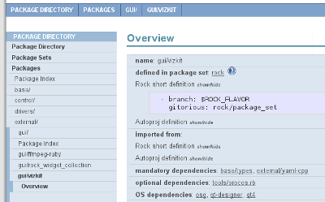

Abstract
-----------
In this tutorial you will learn how to install the rock widget collection 
and Vizkit which are libraries for displaying online and log data.

Finding available packages and oroGen tasks
-------------
Rock's [package directory](/package_directory.html) gives you a general
overview of available 'standard' packages, oroGen tasks and types that are used
on oroGen tasks. It also gives you links to the API documentation for packages
that provide one.  Go have a look.

Package / Packages Sets
-----------
Every repository which contains libraries, widgets, plugins, orogen tasks or orogen deployments 
is called a package. They are organised in package sets which define for autoproj how to download
and install the containing packages.

In this case we want to install two libraries called vizkit and rock_widget_collection. For this we first
check if the packages are already installed or defined in one of the known package sets. To do so
call on the command line (do not forget to source env.sh first):

    autoproj list-config rock_widget_collection
    autoproj list-config vizkit

If the packages are known to autoproj but not installed, autoproj will tell you this in the *warn the following
packages are not installed:* section on the bottom. In this case you can jump to the 
section [Installing Packages](#installing-packages).

If autoporj reports that it cannot find a match for the packages go to section [Adding Package Sets](#adding-package-sets)

If both packages are already installed autoproj will show a list of packages and dependencies for gui/vizkit and gui/rock_widget_collection. And of course there is nothing left to do.

Adding Package Sets {#adding-package-sets}
-----------
Here it is assumed that autoproj does not know the desired packages at all. In this
case you have to tell autoproj where it can find the package sets which contains
the desired packages. An easy way to figure out which package set contains
which package is by looking at
[http:://www.rock-robotics.org](http://www.rock-robotics.org/package_directory/package_sets/index.html)
. After you have find the desired package copy the displayed rock short definition 
string into the file autoproj/manifest of the current autoproj installation. If you are not using the 
default rock installation you can also use the displayed autoproj definition string which is independent of 
rock.

{: .align-center}

In our case the website is reporting the following string for the package gui/vizkit
which tells autoproj where to find the corresponding package set rock which in our case 
also luckily contains rock_widget_collection. 
To add this package set to your current autoproj installation copy the string to the
*package_sets:* section of the file autoproj/manifest.

***NOTE***: The manifest is following the yml syntax where you have to use blanks (no tabs).
{: .warning}

~~~ yml
package_sets:
  - gitorious: rock/package_set
~~~

Now autoproj nows about all packages which are part of the package sets. If you want to install one of them
go to to the next section.

Installing Packages {#installing-packages}
-----------
Here it is assumed that autoproj knows the desired packages and *autoproj list-config package_name* reports
that they are not checkout. If autoproj does not find a match for your desired package go to the section above.

To tell autoproj to install known packages which are not part of the current autoproj installation you have
to add them to the layout section of the file *autoproj/manifest* of the current autoproj installation. 

In this case we want to install the libraries vizkit and rock_widget_collection. For this add the following 
two lines to the autoproj/manifest layout section. 

***NOTE***: The manifest is following the yml syntax where you have to use blanks (no tabs).
{: .warning}

~~~ yml
layout:
  - gui/vizkit
  - gui/rock_widget_collection
~~~

Now, if you call *amake* on the command line autoproj is downloading and installing the two libraries. 

    amake

In this case to check if everything went fine, open a new terminal, go to the
autoproj installation, source the environment (source env.sh) and call
rock-replay on the command line. You should see a small help, how to use the
command line tool, otherwise vizkit was not installed.
    
    source env.sh
    rock-replay

Summary
---------------------
In this tutorial you have learned to: 

 * browse packages in the Rock package directory
 * find an oroGen task that provides or consumes a given datatype
 * install the package

Progress to the [next tutorial](200_display_logging_and_replay.html).

