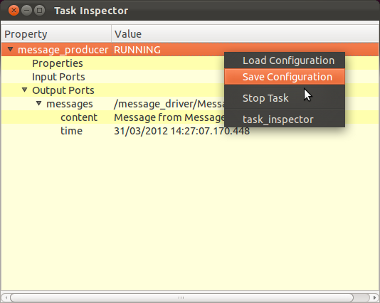
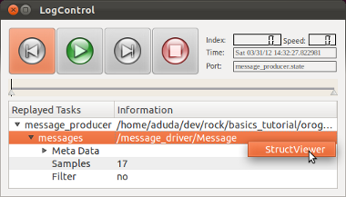

Abstract
-----------
In this tutorial you will learn how to examine your task, have a look on and log data produced by orogen tasks and finally how to replay them.

Task Inspector
---------------
While running a task you can examine the task with the *Task Inspector*.

* Open another console (don't forget to do '. env.sh' there)
* Start your message_consumer script from the previous tutorial
* In the other console start the task inspector with *rock-display message_producer*

You will see the task inspector showing the message producer task. When you click it the entry expands and shows a property section, input port section and an output port section. The output port section also shows the port called message. If clicked on an output port the data are being displayed send by the port allowing to examine them. 

{: .align.center}

If started without argument the task inspector shows up all running tasks after some delay (to select a different Corba Name Service than the local one use the option --host). A right-click on any output port or sub type allows to open available plugins able to display the selected data structure (if you wish to add your custom plugins see Writing a Vizkit Plugin).

Logging Data
------------
By default all tasks come with a logger component that allows writing the data of the output ports to a file.

**Activating logging:** You can activate the logging by calling the ruby
method *log_all* from your ruby start script. If you only want to log the
ports or the properties of the tasks you can also call the methods
*log_all_ports* or *log_all_configuration* instead.

~~~ ruby
Orocos.run "message_producer::Task" => "message_producer",
			"message_consumer::Task" => "message_consumer" do 
    Orocos.log_all
    producer = Orocos.name_service.get "message_producer"
    consumer = Orocos.name_service.get "message_consumer"

    producer.messages.connect_to consumer.messages

    producer.configure
    producer.start
    consumer.start

    while true
        sleep 0.1
    end
end
~~~

All the logged data go by default to log files called *your_task_name.x.log* in
the current working directory. In this case all the logged data go to  
message_producer.0.log. There is also a file message_consumer.0.log which
holds no data since the task has no output port. The digit in the end
increases automatically.

rock-replay
-----------
Rock is shipped with a command line tool for displaying the content of log
files. Therefore, if you want to look into a log file without replaying it to
the framework you can call *rock-replay log_file.x.log* to get a graphical
overview of the logged data.  By double clicking on a port name Vizkit is
trying to find a widget plugin to display the data. If it cannot find one,
vizkit is using a generic struct viewer widget to display the content of the
sample (if you wish to add your custom plugins see Writing a Vizkit Plugin). 
To display the log file recorded above call:  
  
*rock-replay message_producer.0.log*

{: .align.center}

Summary
-----------
In this tutorial you have learned to: 

 * examine a live task with rock-display
 * activate logging
 * visualize the logged data using rock-replay

Progress to the [next tutorial](500_simulate_a_robot.html).

